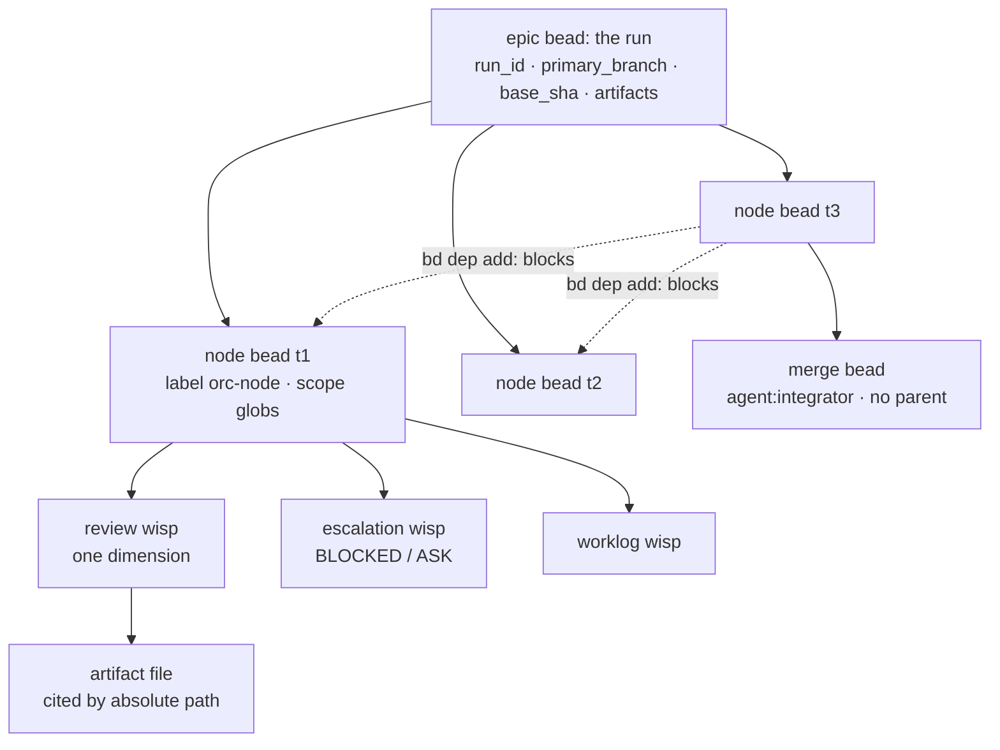
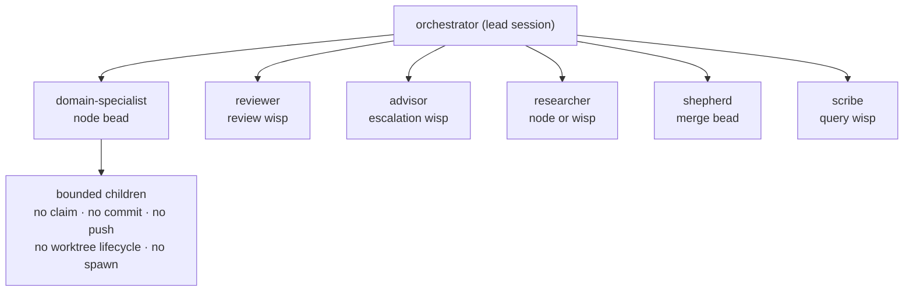
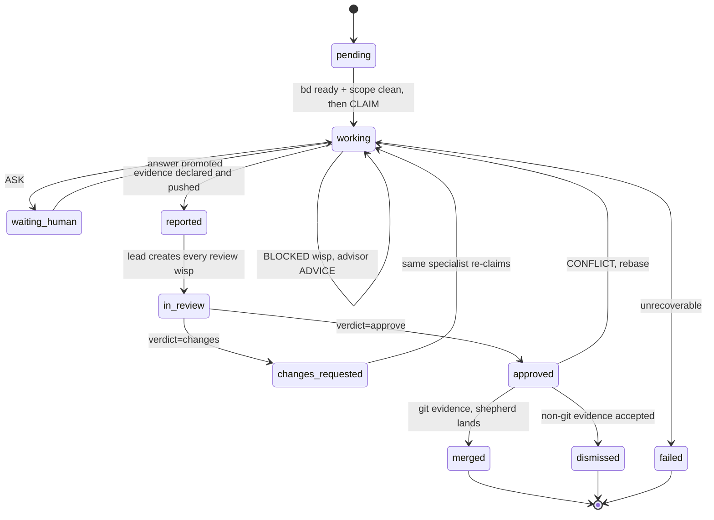
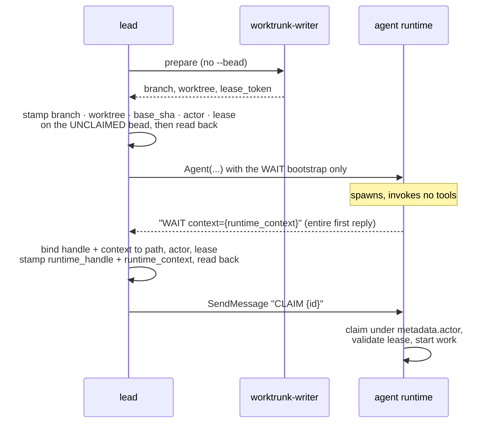
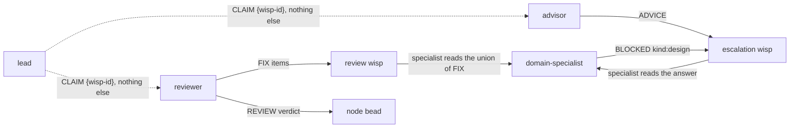
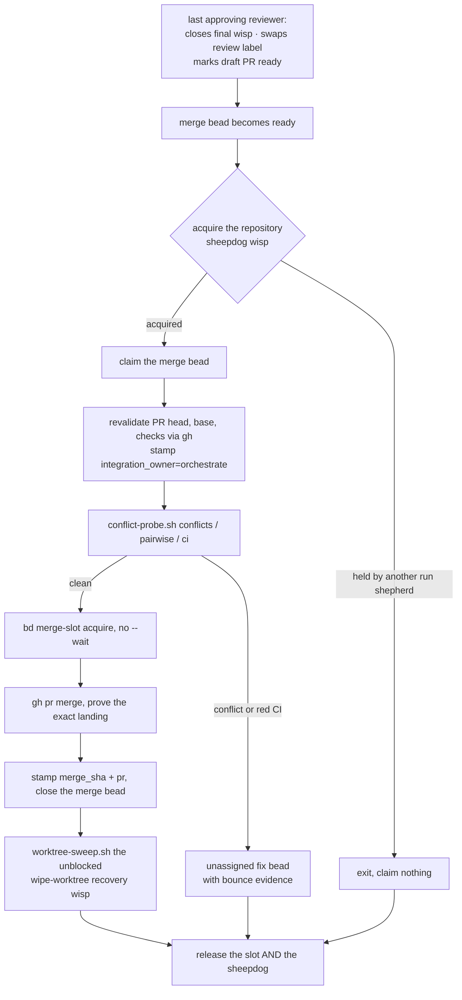

# Orchestrate

`orchestrate` coordinates parallel subagents through a Beads-backed DAG. One
lead session:

- decomposes work into scoped nodes,
- dispatches claim-holding agents into isolated worktrees,
- brokers independent review between them,
- gates merges behind an exclusive slot,
- and keeps a reproducible record.

Run state lives in beads (`bd`), not in the lead's context window.

Requires the `bd` CLI and `wt` (Worktrunk). No `bd` means no run: there is no
fallback store.

```bash
apm install orchestrate@srobroek-agentic --target claude,codex
```

Runtime dependencies: `beads` (state store), `worktrunk-writer` and
`hooks-worktrunk` (checkout allocation), `agent-quality-guards` (read-only
triage roles), `release-queue-watch` (PR-readiness sensor).

## Object model

| Object | Is | Carries |
|---|---|---|
| **Epic bead** | the run | `run_id`, `primary_branch`, `base_sha`, `artifacts` (absolute dir) |
| **Node bead** | one task, `--parent <epic>`, label `orc-node` | `scope` globs, routing envelope, Worktrunk anchors, `state:` label |
| **Wisp** | ephemeral coordination: review, escalation, query, worklog, recovery | one question or dimension; links to its node |
| **Artifact** | a file under `<primary>/.orchestration/run-<id>/artifacts/` | evidence a bead comment cites by absolute path |



The epic plus its dependency edges constitute the DAG. No second graph exists in
JSON, a ledger, or memory.

Merge beads sit outside the epic on purpose, so the repository-global shepherd
can drain them across runs. `bd swarm validate` reports that as an
`outside epic` warning, and for an `agent:integrator` bead it is the correct
shape.

## Roles

Agents shipped by the package, and what each may claim:

| Role | Agent | Model / effort | Writes | Claims |
|---|---|---|---|---|
| Orchestrator | lead session | session model | briefs, wisp shells, leases | nothing; hook-denied |
| Domain specialist | `domain-specialist` (+ `-low/-medium/-high/-xhigh`) | sonnet, per-variant effort | its `scope` only | one node at a time |
| Reviewer | `reviewer` | sonnet / high, read-only | verdicts and findings | one review wisp |
| Advisor | `advisor` | opus / high, read-only | one `ADVICE` answer | one escalation wisp |
| Researcher | `researcher` | sonnet / medium, read-only | artifact output | node or escalation wisp |
| Shepherd | `shepherd` | sonnet / high | PR state and merge records | one merge bead |
| Scribe | `scribe` | haiku / low | report artifacts | one query wisp |

Read-only triage roles arrive from `agent-quality-guards`: `docs-guard`,
`lint-guard`, `data-metrics-summarizer`, `maintenance-metrics-reader`,
`reviewer-mechanics`. They preprocess bounded evidence. Semantic correctness
decisions stay with `reviewer`, `researcher`, or `advisor`.

Agent spawn calls carry `model` but not `effort`, which is frontmatter-static.
The `domain-specialist-*` variants exist so `complexity_tier` can route to an
effort tier; `gen-domain-specialist-variants.py` stamps them from the base
definition.

### Spawn topology

Only the lead spawns claim-holders, and only a specialist nests children:



Children share the specialist's checkout, actor, and lease. Every other actor
spawns nothing. The lead is also the sole dismisser.

## Node lifecycle

Eleven states, stored as a bead status plus one `state:` label. `bd set-state`
owns the label dimension and emits an event bead per transition.



Any state can reach `failed`. `ready` is derived, never stored. `BLOCKED` is
written on an escalation wisp rather than stored as a node state, so a blocked
worker's node stays `working`.

Semantics that fall out of the status column:

- Dependencies clear only on `closed`, so a dependent always starts from a base
  containing its upstream's merged code.
- `failed` maps to status `blocked`, so it never satisfies a dependency and never
  reappears in `bd ready`.
- `bd ready` excludes `in_progress`, `blocked`, `deferred`, and gated beads, so
  the ready front is dependency-correct by construction.

`execution_kind` selects the terminal path. `git` closes as `merged` via the
shepherd; `artifact`, `comment`, and `external` close as `dismissed` by the lead.
Non-git work never creates an empty commit or a placeholder branch.

## Dispatch: two-phase activation

Task data lives on the bead. An activation message is exactly `CLAIM {id}` or
`CLAIM queue:{filter}`, with no scope, commands, review items, or questions.
Spawn and activation are separate operations:



A `BOUNCE` invalidates that attempt. Repair the durable envelope and redispatch a
fresh runtime; the bounced handle is never continued or hand-fed the missing
data.

Routing applies one rule, in order:

1. **Explicit** assignee goes only to that actor. An incompatible explicit
   assignment stays pinned and unclaimed.
2. **Specialist**: the narrowest catalogued agent whose task kinds and
   capabilities cover the routing envelope.
3. **Generic pull**, when no specialist matches: admit the bead to one
   `agent:<queue>` label and leave it unassigned for an atomic
   `bd ready --claim`.

## Peer-to-peer content

The lead creates wisp shells, wakes actors, observes state, and relays nothing:
no questions, advice, review findings, or task briefs. Content moves agent to
agent over wisps:



Eleven verbs: `BLOCKED ADVICE REPORTED REVIEW FIX CONFLICT APPROVE MERGED
DISMISS ASK NO_WORK`. Every factual claim in a message carries a `file:line`,
command result, bead id, or the literal `untested`.

A harness wake is a doorbell: `message` is one verb plus a resource id. The beads
wisp is the durable channel. A **material** message, meaning one that changes
scope, route, ordering, acceptance evidence, disposition, policy, or a human
answer, has no effect until it is promoted to a work-bead comment (bead-local) or
a linked `decision` bead (cross-boundary), read back, and cited.

## Merge path

Merge order is absent from the graph, because which specialist finishes when is
unpredictable. Order follows successful merge-slot acquisition.



Separate mechanisms keep the merge actors apart, and conflating them is a defect:

- The **sheepdog** patrol wisp (`[wisp:patrol] sheepdog <repo>`) stops two run
  shepherds from patrolling one repository. Its id derives from the repository
  name, so any actor computes it without a registry.
- **`integration_owner=orchestrate`** on each merge bead stops the standalone
  `pr-shepherd` from taking this run's PRs. `pr-shepherd` is a separate tool with
  its own state; orchestrate calls none of its scripts and does not depend on it.

The shepherd manages PR state only. It never pushes, edits a PR body, resolves a
conflict, amends a branch, or closes a PR in place of a bounce. Every content
problem becomes an unassigned fix bead carrying the diagnosis, and the
originating specialist repairs it.

## Never wait on a gate

CI, release workflows, release PR checks, and long-running reviewers are gates
rather than work. The lead parks the node with `state=waiting_gate` plus what is
awaited and how to resume, adds `bd gate create --type=gh:run --blocks <bead>
--await-id <run-id>` for a workflow run or `--type=gh:pr --await-id <pr#>` for a
PR merge when an identifier is worth storing, and takes the next ready node.
Once only external waits remain, it writes the run report and exits. The gate
bead and the next pass own the wait.

Missing product intent takes a different path: an `ASK` wisp,
`state=waiting_human`, and a `WAITING_HUMAN` comment whose `question` field names
one exact choice with its impact. The lead polls the human no more than it polls
CI; it continues unrelated ready nodes instead.

## Scripts

Deterministic operations run as scripts so reasoning stays in agents. All are
stdlib-only Python or portable shell, with `_test_*.py` self-tests.

| Script | Does | Exit codes |
|---|---|---|
| `scope-check.py` | glob-disjointness of a candidate against every `in_progress` node; run **before** `bd update --claim` | 0 disjoint · 1 conflict · 2 error |
| `discover-agents.py` | parses agent frontmatter into a catalog with model, tools, isolation | 0 |
| `conflict-probe.sh` | `git merge-tree` conflict prediction without mutating a tree, plus PR check status | 0 clean · 1 conflicts · 2 error |
| `worktree-sweep.sh` | reclaims checkouts through `wt remove`; quarantines broken orphans without deleting contents | 0 swept · 1 dirty, refused · 2 error |
| `resolve-queue-dispatch.py` | maps a `release-queue-watch` record to an approved node | 0 resolved · 2 no owner · 3 ambiguous |
| `inject-comms.sh` | `SubagentStart` hook: injects the comms protocol into every spawn | always 0 |

The scope gate is conservative by design: it serializes work that might have been
safe rather than risk two workers in one file. A bare `**` conflicts with
everything.

`resolve-queue-dispatch.py` exit 2 is the handoff boundary. No orchestrate node
owns that record, so the unchanged line may be offered once to `pr-shepherd`.
Exit 3 means ambiguous orchestrate ownership, which stops there and reroutes
nowhere. No line is ever fanned to both consumers.

## Enforcement hooks

Beads is authoritative, so hooks exist to stop states that would corrupt the
record. Guards fail open: a hook failure emits a warning and still allows the
call.

| Event | Script | Effect |
|---|---|---|
| `UserPromptSubmit` | `orchestrator-run-activate.py` | writes `.orchestration/.active-run`; `bind <epic>` resolves `run_id=pending` |
| `SubagentStart` | `contract-start.py` | tells every spawn that claiming a bead binds its contract |
| `SubagentStart` (skill-scoped) | `inject-comms.sh` | injects `comms-block.md`; a failure warns loudly on stderr and still exits 0 |
| `PreToolUse` (Bash) | `orchestrator-claim-deny.py` | denies `bd ... --claim` in the lead while a run is active |
| `PreToolUse` (Agent, SendMessage) | `orchestrator-activation-guard.py` | enforces the WAIT, bind, CLAIM order |
| `SubagentStop` | `rules-eval.py` | evaluates the stopping actor's claimed bead against its rules file |

The activation guard refuses a `CLAIM` whose resource is terminal, absent,
already claimed, missing a prepared lease, or bound to a different runtime
handle. It also denies a task-bearing spawn of an unrecognised agent type: an
activation that cannot be verified is worse than a refused one.

`rules-eval.py` reads one JSON rules file per role. That same file compiles the
"Your bead contract" block into the agent definition, so the enforced contract
and the stated contract cannot drift.

| Role | Must produce | Cannot set |
|---|---|---|
| `domain-specialist` | `REPORTED` plus branch and push (git) or a contained `output_ref` (artifact), and the reviewer handoff label | status `closed`, `merge_sha`, `pr` |
| `reviewer` | a `REVIEW` verdict | state `merged`, `push`, `merge_sha`, `pr` |
| `advisor` | one `ADVICE` answer | `merged`, `approved`, `changes_requested`, all delivery metadata |
| `researcher` | `REPORTED` with an `output_ref` or a wisp answer | `merged`, `approved`, `push`, `merge_sha`, `pr` |
| `scribe` | `REPORTED` | every delivery field, `branch` included |
| `shepherd` | landing evidence | any review-verdict state, `worktree`, `output_ref` |
| `*` (fallback) | `REPORTED` | status `closed`, `merge_sha`, `pr` |

A specialist legitimately writes `push` and `branch` yet may never close its own
node. A shepherd legitimately writes `merge_sha` and closes merge beads yet may
never set a review verdict. The `*` fallback catches any agent that holds a claim
without a rules file of its own, which closes the claim-to-contract net across
the whole fleet.

Failure is always a valid exit: status `blocked` plus a `FAILED` or `BLOCKED`
comment.

## Recovery

Every process restarts, because beads, wisps, GitHub, and pushed branches are the
source of truth. After lead compaction or a crash:

1. Match the epic by metadata `run_id`.
2. Read in-flight nodes (`--status in_progress`). Each carries its actor in
   `assignee`, its dispatch mode, and its `state:` label. Confirm every stamped
   checkout through `wt list --format=json`.
3. Run `bd merge-slot check`. Never infer a dead holder from age.
4. Resume each live assignee with `CLAIM {same-resource}` to its handle, or
   respawn the same actor and send the same activation.
5. Restart watchers with `--slots=1` and replay any dispatch lacking a matching
   ack.

Dead-claim recovery needs evidence rather than a timestamp. No lease expiry and
no daemon exist. Clear ownership only once the platform reports the handle
stopped, the actor releases it, or the user confirms the session is dead. Record
that evidence, then:

```bash
bd update <bead> --assignee "" --status open
bd set-state <bead> state=pending --reason "dead claim verified; redispatch"
```

If death is uncertain, keep the assignment and record a revisit trigger. That
default is what prevents two workers mutating one scope.

An unassigned `in_progress` node with `REPORTED` and `agent:reviewer` is a valid
review handoff. Without that evidence it is inconsistent, and recovery runs
before redispatch.

## Cost model

The lead's context window is the run's non-recoverable resource. It spends tokens
on coordination only: high-level decomposition, `bd`, the bundled scripts, and
content-free wakes. Reading source, writing code, research, diff review, running
tests, and deep planning all go to the cheapest capable subagent, and only the
terse result returns. Even a worker or hook failure is diagnosed by a delegated
node reading the durable evidence, never by opening hook implementations in the
lead.

Concurrency caps at `min(16, cores - 2)` state-changing workers, lower when disk
is tight, because every git-backed worker carries its own build artifacts. Idle
queue workers that have claimed nothing do not count as parallelism.

Claude agent-teams are a rare gated exception rather than the fan-out mechanism.
Teammates cannot spawn background subagents, which breaks the brokered advisor
and the persistent shepherd and scribe. Triggers that justify a team:
adversarial multi-hypothesis debugging, live cross-layer interface negotiation,
and parallel independent review of one artifact. Teams also need
`CLAUDE_CODE_EXPERIMENTAL_AGENT_TEAMS=1`, and no `SubagentStart` hook reaches a
teammate, so `comms-block.md` goes into each teammate brief verbatim.

## SpecKit and external frameworks

A beads-managed SpecKit molecule already is a dependency-aware DAG. When one
drives the work, its step beads become the run's node beads: add the `orc-node`
label and `scope` metadata so the scope gate, state mapping, and anchor contract
apply unchanged. Building a second graph on top is the failure mode.

---

See also: [bundles](bundles.md) · [skills](skills.md) · [agents](agents.md) ·
[steering](steering.md) · [hooks and MCP](hooks-and-mcp.md) ·
[SpecKit](speckit.md)
