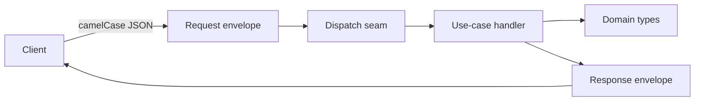
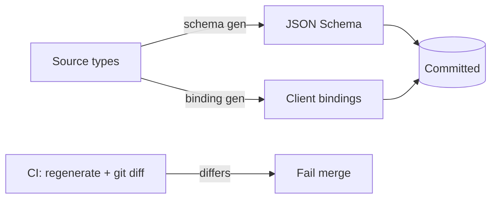

# Rust Contract Boundary

## Rules

- Isolate the DTO boundary in its own crate that depends on domain but is never imported by domain or persistence.
- Use a generic transport envelope (request/response) with a pinned contract-version constant; assert the version on both sides.
- Generated cross-language bindings are authoritative: commit them, fail CI on `git diff --exit-code` after regeneration; hand-written client wrappers are transitional and conformance-tested against them.
- Registered command/operation names must equal client invoke targets exactly; never rename invoke targets; encode as a CI-failing test (e.g. forbid dotted invoke strings).
- Pin one wire casing on both sides with `rename_all`; a single mismatched key fails the whole payload — guard with a static test.
- A mock/stub transport hides real-backend mismatches; enforce name/casing/schema conformance with tests against the real surface.
- Route generated calls through a single dispatch seam (mock / record / real); wrap free-form `unknown` payloads in an opaque newtype.
- The error-code/wire-error model lives in the `language-steering-rust` `rust.errors` doc.

## Boundary layers

## Codegen drift gate

