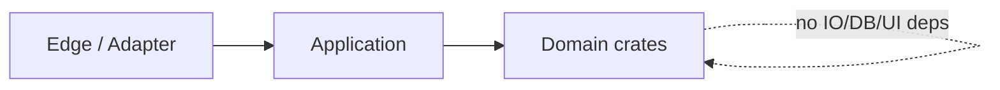

# Rust Crate Boundaries

## Rules

- Split crates by domain concern, not by file count; each crate MUST compile independently without forcing IO/DB/UI rebuilds.
- Dependencies point inward only: pure domain ← application ← edge/adapter; a domain crate MUST NEVER import an application or adapter crate.
- When IO or network creeps into a domain crate, extract it into a sibling adapter crate immediately.
- `lib.rs` is a thin facade: module declarations and curated re-exports only; top-level legacy aliases are a migration smell.
- Group related crates under nested directories by concern; the directory tree is the architecture — a flat crate list in `Cargo.toml` hides it.
- Keep cross-domain orchestration in an umbrella crate; preserve stable public paths via re-export when splitting.
- Allowed dependency surface per layer: domain → `std` and pure logic crates only; application → domain only; adapter/edge → application and domain.
- Split a single mega-crate by domain concern first, then by IO boundary; `lib.rs` over ~50 lines of logic means logic leaked into the facade — push it down.
- Resolve circular crate deps by merging the mis-split concern or introducing a shared types crate.

## Dependency direction

