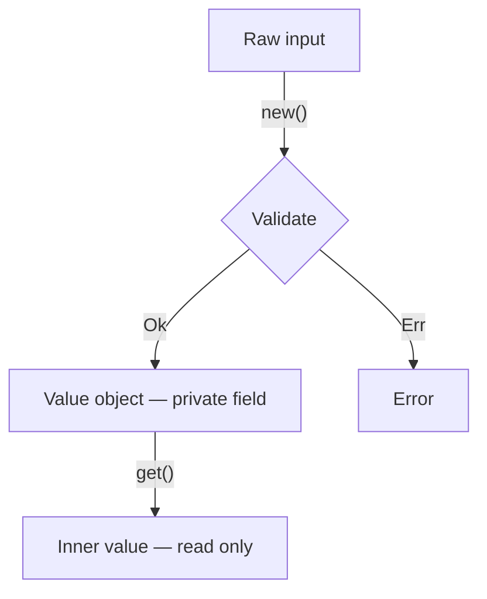

# Rust Domain Modeling

## Rules

- Newtype IDs and hashes:
  - Private inner field; derive `Copy + Eq + Hash + PartialEq + PartialOrd + Ord` and annotate `#[serde(transparent)]`.
  - Expose only via a `const fn new(raw: T) -> Self` constructor; do not return `&inner` directly.
  - Implement `Display` and `Debug` via the inner type; do not otherwise re-expose the primitive.
- Validated value objects:
  - Private field + fallible `pub fn new(raw: T) -> Result<Self, DomainError>`; const getter returns the inner value by copy or reference, no setter.
  - Reject invalid state at construction, not scattered at call sites; unit-test boundary conditions in the same module (`#[cfg(test)]`).
- State machines as data:
  - Encode allowed transitions as `const TRANSITIONS: &[(State, State)]` and gate every transition site with one `fn is_allowed(from, to) -> bool` predicate, not scattered `match` chains.
  - Return a typed error when a transition is rejected; log the `(from, to)` pair.
- Error design:
  - One `#[derive(thiserror::Error)]` enum per module scope, sized to the operation; define a `pub type XResult<T> = Result<T, XError>` alias per crate.
  - Avoid a single god-error enum spanning the whole crate; wrap foreign errors with `#[from]` only when the foreign type is stable.
- Dependency-inversion ports:
  - Define a narrow `pub trait Port: Send + Sync` with the minimum surface; ship `RealPort` (production) and `FakePort` (in-crate test double) together.
  - Logic crates depend only on the trait; infrastructure crates provide `Real*`.
- Deterministic identity:
  - Derive stable IDs via `Uuid::new_v5(&NAMESPACE, canonical_string.as_bytes())`; cache the namespace in a `static NAMESPACE: OnceLock<Uuid>` and document the canonical string format alongside the type.
- Degraded-mode default:
  - When a missing input would make a pure constructor fail, substitute a deterministic default and record a `degraded: bool` marker; never silently succeed, and propagate the marker so callers can warn.

## Value object lifecycle

