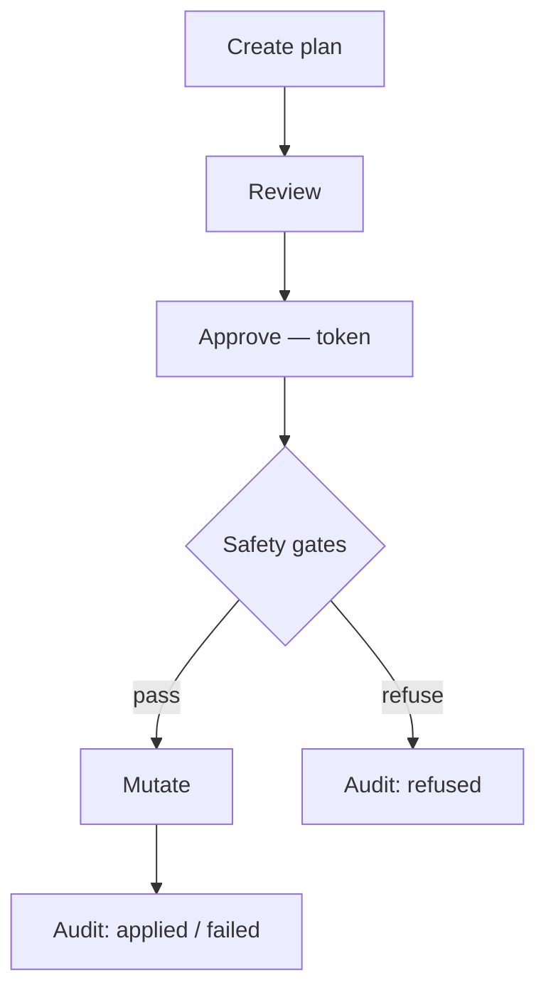
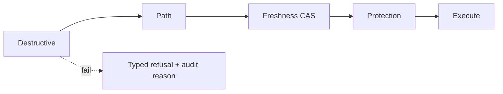

# Rust Safe Mutation

## Rules

- Model side-effecting operations as a serializable plan of typed items; require explicit review and approval before apply — never apply eagerly.
- Approval is a re-verified token checked at apply time, not a boolean stored at review; a stale token MUST error, never silently proceed.
- Write an audit record per attempted action AND its outcome (applied / refused / failed); the audit trail is append-only and is never replaced by the live progress stream (the stream is additive).
- Default conflict policy fails if the destination exists; NEVER overwrite silently; prefer trash/archive over permanent delete; permanent delete requires a separate explicit consent.
- Revalidate item freshness (size + mtime compare-and-swap) at apply time; a changed item pauses the plan.
- Normalize paths lexically (no `canonicalize`); `lstat` each component; reject symlink/junction traversal unless explicitly enabled per root.
- Run a deterministic per-item gate pipeline (destructive → path → freshness → protection → mutate); each gate emits a typed refusal reason.
- Eventual linkage: when a reference cannot resolve at write time, enqueue it and backfill later via an idempotent guarded update.

## Mutation lifecycle

## Per-item gates

