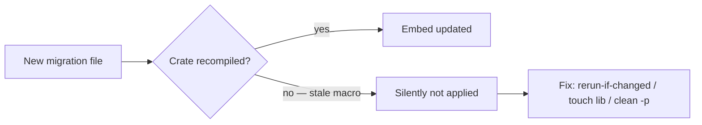

# Rust Persistence Defaults

- Treat the DB as the durable record; on-disk artifacts (manifests, generated views) are reproducible projections — not canonical unless a documented decision says so.
- Isolate persistence in its own crate behind a thin handle owning the connection pool; no domain or application crate imports persistence internals.
- Make state transitions atomic compare-and-swap inside a transaction (`UPDATE … WHERE state = expected`); zero rows ⇒ distinguish not-found vs CAS-failed by re-reading. Avoid SELECT-then-write on a bare pool — it races unless serialized.
- Number migrations, keep them append-only and embedded; never edit a committed migration — add a new one.
- Keep migration prefixes unique across branches: parallel branches each grabbing the next number collide. Add a CI duplicate-prefix guard (or a timestamp/monotonic scheme); a "latest prior = NNNN" header comment goes stale on merge.
- Gotcha: an embed macro captures the migrations directory at compile time; a new file can go unapplied until the crate recompiles. Add a `build.rs` with `cargo:rerun-if-changed=migrations` and verify with a real-DB test.
- Build dynamic SQL from static fragments only, always bind values, and justify each escape hatch with a comment.
- Test against a real in-memory DB running real migrations — no mock DB.

## Migration embed gotcha

