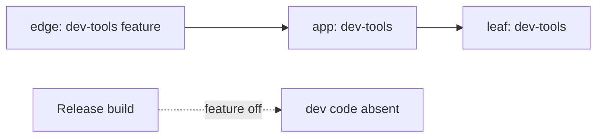

# Rust Workspace Defaults

## Rules

- Lints: centralize in `[workspace.lints]` (forbid `unsafe`, or warn under review); members inherit via `[lints] workspace = true`. Run clippy `all` + `pedantic` at `warn`; CI upgrades to `-D warnings`. Per-crate overrides only for documented exceptions, marked `// LINT(crate-name): reason`.
- Dependencies: declare all semver ranges in `[workspace.dependencies]`; members reference `{ workspace = true }` with a one-line why-comment. Don't pin patch-level unless a known breakage exists (link it). Bump once per workspace.
- Dev dependencies: confine `[dev-dependencies]` to the crate that uses them — no shared test deps in the workspace root. Add a `tests-common` lib crate only when multiple crates share elaborate fixtures. Keep automation deps (`cargo-nextest`, `cargo-machete`) in CI/toolchain files, not `[dev-dependencies]`.
- Test layers: unit (single module, no I/O) and integration (multi-module, fixtures) run on the default profile, unlimited parallelism; E2E (full system, DB, network) runs serial/limited under `[profile.e2e]` (`opt-level = 0`, `--test-threads=1`). Use `cargo test -p <crate>` when the workspace suite is red elsewhere.
- Compile boundaries: shared DTOs on a gated path compile unconditionally in a dedicated crate (e.g. `contracts-core`); don't spread feature flags across DTO boundaries — gated paths depend on the DTO crate, not vice versa.

## Feature-gated dev surface

- Any dev-mode, testing, or debug surface MUST live behind a default-off Cargo feature (e.g. `dev-tools`, `test-harness`), via `#[cfg(feature = "…")]` not a runtime flag.
- The gate propagates down: edge binary declares it (optional), app crate enables it, leaf crates compile only when an ancestor enables it.
- Release binaries build with the feature off so the code is absent at compile time, not runtime-hidden.

## See Also

- `rust.ci.context.md` — CI caching strategy, matrix gates, and dependency resolution
- `rust.tooling.context.md` — `rustfmt` and clippy config, nextest runner, coverage tooling
