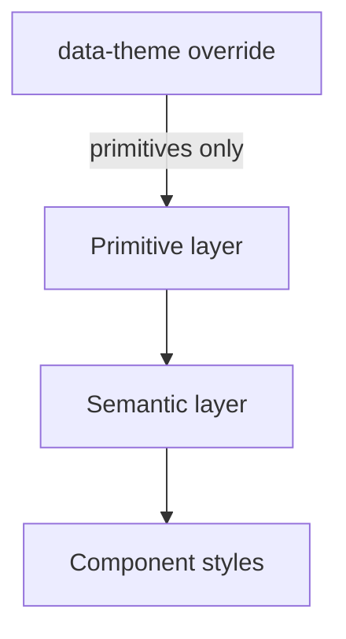

# TypeScript Styling & Theming

## Token layers

## Rules

- **Two layers**: primitives are raw named values (`--color-blue-500`, `--space-lg`) defined globally (`:root`/`:host`); semantics are intent-based aliases (`--color-action`, `--color-text`) that map primitives via CSS custom properties.
- Components consume semantics only; theme overrides target the primitive layer only, so semantics and scale stay theme-invariant.
- **Theme scoping**: apply `data-theme="<name>"` on the root and override primitives within the `[data-theme="<name>"]` block; all tokens inherit, so component code stays theme-agnostic. Live preview re-scopes `data-theme` on a nested container (avoids inline hex overrides).
- **Density**: model density (compact, normal, spacious) as an orthogonal class composing independently with any theme; each variant (e.g. `.ns-density-compact`) overrides a small, explicit set of `--space-*` / `--size-*` primitives.
- **Component primitives**: thin typed layers map `variant`/`size` props to modifier classes (e.g. `.ns-btn--primary`, `.ns-btn--lg`), keep style rules external, and forward `ref` + merge caller `className`. A BEM-like prefix (`.ns-block__el--mod`) prevents collisions.
- **Styling approach** (choose per project constraint; enforce token consumption, not tooling): global CSS + BEM/utility modifiers, CSS Modules for scoped styles, or CSS-in-JS (e.g. Emotion, styled-components, Tailwind CSS) with token injection.
- **Enforcement**: a stylelint rule forbids hardcoded color/size literals in component stylesheets (hardcoded values are reviewable, documented exceptions); scan imports to verify components consume semantic tokens only.
