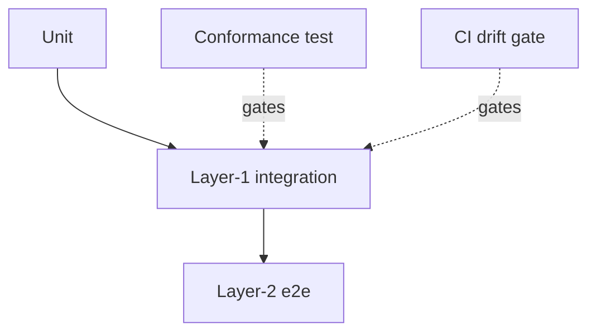

# TypeScript Testing

## Test pyramid

| Layer | Scope | Mocking | Gating |
|-------|-------|---------|--------|
| Unit | Pure functions, isolated components (jsdom) | Full dependency injection | None |
| Layer-1 integration | Real business logic, mocked network edge only | Schema-matching IPC fixtures via DI | Conformance test, drift gate |
| Layer-2 e2e | Full stack via browser automation | None | Infrastructure availability (backend-mode flag) |

## jsdom setup

- Centralize all jsdom shims (localStorage, global mocks, library layout stubs) in one file (e.g. `vitest.setup.ts`), loaded via the framework setup-files option — never inline per test.

## IPC/API wrapper testing

- Test wrappers against **real generated response shape** by injecting a DI override returning schema-matching fixtures (e.g. `{ status: 200, payload: {...} }` matching the binding exactly); reset the DI mock in `afterEach` so mismatches cannot hide behind stale fixtures.

## Conformance test (Layer-1 gate)

- A static test reads generated binding files as raw text and asserts wrapper calls match registered command names exactly: no casing drift, no dotted aliases, no invented names.
- Run in CI before Layer-1 tests; failure gates the suite. Catches codegen stale-binding bugs (e.g. tauri-specta rename mismatches).

## Backend-mode isolation (Layer-2)

- When splitting e2e by backend mode (mock vs. real), keep separate Playwright configs per mode and pin the backend-mode flag explicitly in each (not as app default) — prevents silent drift when the default changes.

## CI drift gate

- After any generation step (codegen, schema migration, binding export), run `git diff --exit-code` on generated files and fail CI if artifacts are non-deterministic — non-determinism hides drift and causes phantom flakes.

## Test layers

## Cross-reference

- IPC seam invariants: See `language-typescript` contract-boundary doc (bindings, payload casing, command registration).
