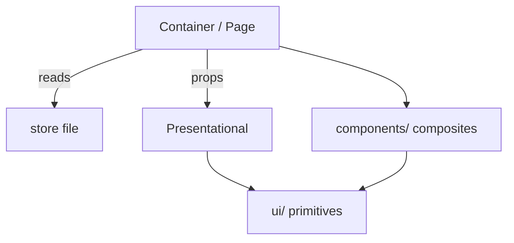

# TypeScript Component & Layout

## Component Tiers

| Tier | Typical location | Role |
|------|-----------------|------|
| Primitives | `ui/` | Atomic, stateless; no business knowledge |
| Composites | `components/` | Cross-feature reusable; may compose primitives |
| Feature components | `features/<name>/` | Domain-aware; never imported by other features |

- Imports flow downward only: feature → composites → primitives; never upward.
- Barrel files (`index.ts`) at each tier act as an intentional deprecation ledger — remove exports there first.

## Page Layout Primitive

- Define **one** layout primitive that pins headers and action bars and provides **exactly one** scrollable content region.
- All pages compose from it; none re-implement scroll containment independently.
- Annotate the primitive with doc-comments that state implicit layout contracts (e.g. "do not nest inside another scroll container").

## Slot Props

- Prefer named `ReactNode` slot props (e.g. `topBar`, `detail`, `actions`) over boolean-prop explosion.
- Render a slot region only when its prop is truthy — no empty wrappers.

## Feature Slice Structure

- One folder per feature under `features/<name>/`: container page, presentational sub-components, store file, and co-located tests all live together.
- **Container** (`<Name>Page.tsx`) owns data-fetching, store subscriptions, side effects, navigation.
- **Presentational** (`<Name>List.tsx`, `<Name>Detail.tsx`) own pure render from props; no direct store reads; independently testable.
- Enforce the split at review; do not merge the two roles into one file.

## Feature slice & component tiers

