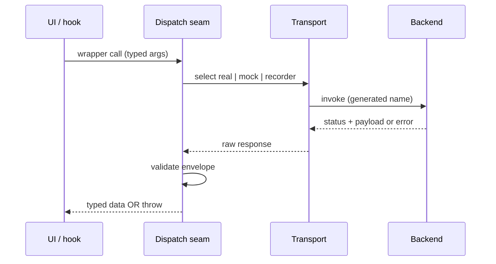

# TypeScript Contract Boundary

## Generated surface is authoritative

| Concern | Rule |
|---|---|
| Binding names | Generated bindings (e.g. from tauri-specta, openapi-typescript, gRPC codegen) are the single source of truth; hand-written wrappers delegate to generated names — never invent aliases or dotted shorthands |
| Key casing | Use the exact casing the generator emits; payload keys that diverge cause silent runtime mismatches that mocks hide |
| Drift gate | A static conformance test reads the generated surface and asserts every wrapper uses a registered name with matching casing; run in CI so generated-surface drift fails the build |

## Dispatch seam

- All IPC/API calls route through one dispatch seam that selects real / mock / recorder transport; UI code imports only the seam, never a transport directly. The seam owns transport selection, envelope unwrap, error normalisation, and optional telemetry.
- Unwrap once at the seam: `{ status: "ok", payload: T }` → return `T`; `{ status: "error", code, message }` → throw `TypedApiError`. Callers receive typed data or a typed error — never a raw envelope. Duplicate unwrap logic in callers is a smell.

## Runtime validation scope

| Input | Validate? |
|---|---|
| Envelope shape (`status`, `code`); payloads typed `unknown` | Yes — validate / apply schema (e.g. zod) at seam boundary |
| Already-typed generated payloads | No — pass through; re-parsing adds cost with no safety gain |

## Mock mode & cross-language

- Mock mode is not a real-stack test; mocks hide name / casing / shape drift, so conformance tests + real-backend integration tests catch what mocks cannot. Keep mock fidelity high (same generated names, same envelope shape) to minimise the gap.
- Server-side counterpart (command registration, binding export, envelope encoding) lives in the `language-rust` contract-boundary context; the "generated surface is authoritative + CI drift gate" theme applies on both sides.

## Boundary sequence

