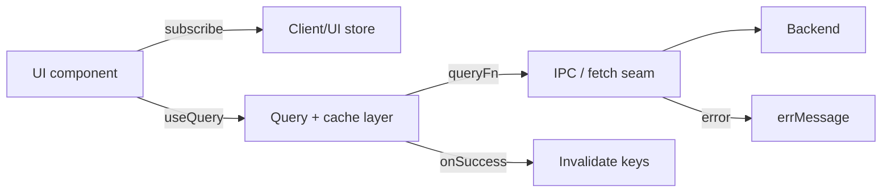

# TypeScript State & Data

## State separation

| Layer | What belongs here | Example libraries |
|---|---|---|
| Server / async state | Data fetched over network or IPC; loading & error status | TanStack Query, SWR, Apollo |
| Client / UI state | Selection, panel open/closed, theme, transient form state | Context, Zustand, Jotai, Redux, `useSyncExternalStore` |

- Keep the two layers independent (no server responses in UI stores unless intentionally denormalised); optimistic updates, undo, and offline sync are valid extensions of the same principle.

## Query keys & invalidation

- Centralise query keys as a hierarchical tuple factory (e.g. `keys.items.list(filter)`, `keys.items.detail(id)`), co-located with the hooks that consume them.
- Derive detail and aggregate keys from a shared prefix so one prefix-level invalidation cascades correctly.
- After a mutation succeeds, explicitly invalidate affected key prefixes in `onSuccess` (or equivalent); prefer prefix invalidation for entities with many derived views.
- Scope optimistic rollbacks to the specific key updated, not the whole cache.

## Uniform query facade

- Expose `QueryState<T> = { data: T | undefined; loading: boolean; error: string | null }` from store modules.
- Do not leak library-internal result shapes (raw `QueryObserverResult`, Apollo `ApolloQueryResult`, etc.) into component props or context values.

## Error normalisation

- One `errMessage(unknown): string` utility with structural guards and an ordered fallback chain; one `isContractError(unknown)` type guard; one build-checked `code → message` map verified at compile time.
- Both query and mutation layers import from this single utility; no ad-hoc `e?.message ?? String(e)` scattered across components.

## IPC / fetch seam

- Funnel IPC or fetch calls through one typed dispatch seam.
- `queryFn` / `mutationFn` stay idiomatic (return data or throw); unwrapping, deserialisation, and error coercion happen inside the seam, not in each hook.

## Data flow

